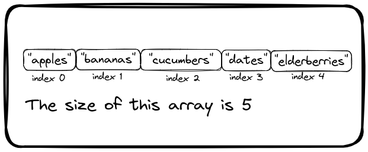
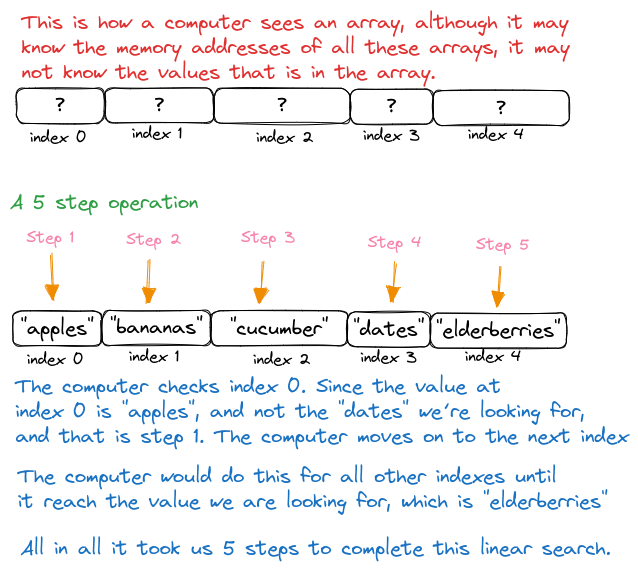

# A-Common-Sense-Guide-to-Data-Structures---Algorithms---Book-Notes

*This is my summary of **A Common Sense Guide to Data Structures And Algorithms, Second Edition** by Jay Wengrow. This summary helps me learn and serves as a quick reference. It does not replace the book, so I recommend buying and reading it if you want to understand the concepts better. Use this repository as a guide and a reference only.*

**Please send me a DM by [Twitter](https://twitter.com/akuoko_konadu) or [LinkedIn](https://www.linkedin.com/in/konaduakwasiakuoko-codedkaa/) if you are the publisher and you want this repository to be private. I will change the settings accordingly.**

Help the creator out by buying the book on [Amazon](https://www.amazon.com/Common-Sense-Guide-Structures-Algorithms-Second/dp/1680507222). Just to clarify I ain't getting any money by linking the book here.

**Contributions:** Issues, comments, and pull requests are welcome

This version here uses TypeScript. To go over to the Python version go [here](/Python/README.md).

---

## Table of Content

1. [Why Data Structures Matter](#1-why-data-structures-matter)
2. Why Algorithms Matter

---

## 1. Why Data Structures Matter

- **Data:** it refers to all types of information down to the most basic numbers and strings.
- **Data Structures:** it is how data is organized. It is the data in an array, int, set, string, etc.
- Organization of data doesn't just matter for organization sake, but it can significantly impact how fast your code runs.

### The Array: The Foundational Data Structure

Array is the most basic data structure in CS.

The size of an array is how many data elements the array holds.

The index of an array is the number that identifies where a piece of data lives inside the array.

### Data Structure Operations

To understand the performance of any data structure we need to analyze the common ways our code might interact with the data structure.

Many data structures are used in four main ways:

1. **Reading:** Looking something up at a **particular spot** within the data structure.
2. **Searching:** Looking for a **particular value** within a data structure.
3. **Inserting:** Adding a new value to the data structure.
4. **Deleting:** Removing a value from the data structure

### Measuring Speed

When measuring the speed of a code, we measure how fast an operation takes in terms of steps it takes, not the amount of time it takes.

If operation A takes 5 steps and operation B takes 500 steps to finish the same amount of taks, we say operation A is the fastest

#### Reading

In terms of reading from an array, it's one of the fastest operations. Because computers know how to jump to a specified index at anywhere in the array at any given time.

Reading fro an array is a very efficeint operation. Because computers can read any index by jumpint to the memory address in **one step**.

- **NB:** We can say that the worst case scenario from reading from an array is 1. Where 1 is the number of operations it takes.

#### Searching

Searching means providing the computer with a value, and asking it to return the index of that value's location.

Searching is tedious, since the computer has no way to jump to a particular value.

- **NB:** A computer has immediate access to all of it's memory addresses, but it has no idea offhand what values are contained at each memory address.

**Linear Search:** it is the type of searching where the computer checks each cell one at a time to find it's target value (the value you're searching for), and the target value's index.

> What is the maximum number of steps a computer would need to perform a linear search?

- For N number of cells in an array, linear search would take a maximum of N steps. Where **mostly N is the size of the array**.
- So this means that for a 500 array, in the work case scenario a linear search would tak up to 500 steps to find the index of an element you are looking for.
- And if by chance that element is not in the array, it'll need to check every cell in the array to make sure the value you are looking for is not in the array. And that is the worst case scenario for a linear search algorithm.

The following diagrams demonstrate the process the computer would use to
search for "elderberries" within our array:

**NB:** Searching is less efficient than reading. Since reading takes one step, and searching can take N steps (where N is the size of the array).
